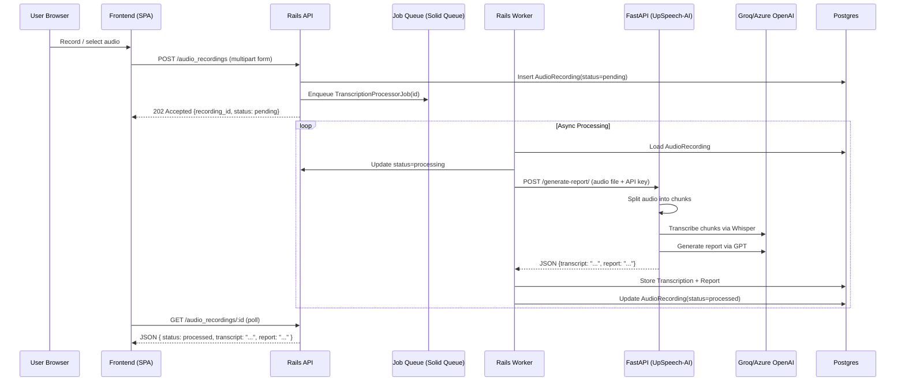

# UpSpeech System Design

Version: 0.3 (Consolidated)  
Last Updated: 2025-09-12

## 1. Goals

- Ship a lean first version (marketing site + web app + Rails API) without blocking future scale.
- Support multi-tenant SaaS from day one (soft isolation) with a clear upgrade path.
- Keep operational footprint small (Railway) while enabling gradual hardening: observability, background jobs, object storage (optional Phase 2), billing, analytics.

## 1.1 MVP Implementation Plan

For detailed feature planning, implementation status, and sprint breakdown, see:

- **[MVP Roadmap](../planning/MVP_ROADMAP.md)** - Complete 7-phase MVP plan with user stories, technical specs, and timeline
- **[Current TODO](../planning/TODO.md)** - Current sprint tasks and immediate priorities
- **[Changelog](../CHANGELOG.md)** - Sprint completions and feature history
- **[Claude Context](../../.claude/CLAUDE.md)** - AI assistant context file (project overview and current priorities)

**Current Status**: Sprint 3 Complete (October 17, 2025)
**Completed Phases**: Phase 2 (95%), Phase 5 (75%), Phase 7 (100%)
**Next Priorities**: Phase 1 (90% - therapist linking), Phase 3 (50% - disfluency detection)
**Overall MVP Progress**: 70% Complete

## 2. High-Level Architecture

```mermaid
flowchart LR
  subgraph Browser
    UI[React/Vite SPA]
  end

  subgraph RailsApp[Rails Backend]
    API[Rails API]
    QUEUE[Solid Queue Jobs]
  end

  subgraph PythonService[UpSpeech-AI Service]
    FASTAPI[FastAPI Endpoint]
    GROQ[Groq/Azure OpenAI]
  end

  UI -->|HTTPS JSON (JWT)| API
  API --> DB[(Postgres)]
  API -->|Enqueue Job| QUEUE
  QUEUE -->|HTTP + Audio File| FASTAPI
  FASTAPI -->|Chunks & Transcribes| GROQ
  FASTAPI -->|Returns Report JSON| QUEUE
  QUEUE -->|Updates DB| DB

  subgraph OptionalPhase2
    STORE[(Object Storage S3/MinIO)]
  end
  API -. store/retrieve .-> STORE

  API --> OBS[(Logging / Metrics)]
```

### Components

| Component                         | Purpose                                    | Notes                                                              |
| --------------------------------- | ------------------------------------------ | ------------------------------------------------------------------ |
| Web Frontend (Vite/React)         | User interaction layer                     | Deployed as static assets + edge CDN (Railway static or similar).  |
| Rails API (API-only)              | Web app orchestration, auth, multi-tenancy | Handles uploads, job queuing, data persistence, user management.   |
| UpSpeech-AI Service (FastAPI)     | Audio processing & AI transcription        | Python service with Groq integration, audio chunking, report gen.  |
| Postgres                          | Primary relational store + job queue       | Single shared DB; `tenant_id` column on multi-tenant tables.       |
| Solid Queue                       | Background job processing (Rails 8 native) | Orchestrates calls to FastAPI service, handles retries & failures. |
| Object Storage (Optional Phase 2) | Audio blobs, reports, datasets             | Start with local disk in dev; add S3/MinIO later.                  |
| Mail (SMTP / Mailer Service)      | Transactional email                        | Mailcatcher in dev.                                                |
| Observability Stack               | Logging, metrics, tracing                  | Phase 1: Rails + structured logs; Phase 2: OpenTelemetry exporter. |
| Feature Flags (Future)            | Progressive delivery                       | LaunchDarkly / Flipper optional.                                   |

## 3. Audio Processing Sequence (Current Feature Focus)



Polling initially; upgrade to Server-Sent Events or WebSockets for push notifications later.

## 4. Multi-Tenancy Strategy (Summary)

See `MULTI_TENANCY.md` for detail.

- Phase 1: Shared schema + `tenant_id` per row.
- Phase 2: Optional RLS + selective schema/db isolation.
- All background jobs carry explicit `tenant_id`.

## 5. Domain Model (Early Sketch)

- Tenant (has_many Users, Subscription)
- User (belongs_to Tenant)
- AudioRecording (belongs_to Tenant, User)
- Transcription (belongs_to AudioRecording)
- Report (belongs_to Tenant, User; references transcription snapshot)
- RefreshToken / Token (if persisted)

## 6. Background Processing

**Rails Orchestrator**: Solid Queue manages job lifecycle, retries, and failure handling.  
**Python Worker**: FastAPI service (`upspeech-ai`) handles CPU-intensive AI processing.  
**Integration**: Rails jobs make HTTP requests to FastAPI `/generate-report/` endpoint.  
**Queues**: `critical`, `default`, `low` - dashboard at `/admin/solid_queue`.  
**Fault Tolerance**: Rails handles retries, timeouts, and fallback behavior.

## 7. Caching & Performance

- HTTP: ETag + Last-Modified where safe.
- Rails cache: use Solid Cache (Postgres-backed) for transient aggregates.
- DB: Use composite indexes `(tenant_id, created_at)` on high-volume tables.
- Future: Add read replica before sharding.

## 8. Object Storage (Optional – Phase 2)

| Why               | Deferred Until                | Notes                       |
| ----------------- | ----------------------------- | --------------------------- |
| Large audio files | Real user volume / >5GB local | Local disk ok early.        |
| Generated reports | DB size / export frequency    | Small HTML can live inline. |
| Model artifacts   | Fine-tuning stage             | Skip until needed.          |

Abstraction: `StorageProvider` interface -> `LocalDiskStorage` then S3/MinIO.

## 9. Security & Compliance (MVP)

- TLS via platform.
- **Current**: Session-based authentication with HttpOnly cookies.
- Password hashing: Argon2id preferred; bcrypt fallback.
- Rate limiting on auth endpoints.
- Audit log (Phase 2) for auth + exports.
- Secret management: Railway variables; no secrets in repo.

## 10. Environment Variables

| Variable               | Purpose                                                  |
| ---------------------- | -------------------------------------------------------- |
| SECRET_KEY_BASE        | Rails session signing key                                |
| DATABASE_URL           | Postgres connection                                      |
| UPSPEECH_AI_URL        | FastAPI service endpoint (e.g., http://upspeech-ai:8081) |
| GROQ_API_KEY           | Groq API key for transcription service                   |
| AZURE_OPENAI_KEY       | Azure OpenAI key (alternative to Groq)                   |
| ACTIVE_STORAGE_SERVICE | local (dev) / s3 (later)                                 |

## 11. Observability & Ops

Phase 1: structured JSON logs, request timing, error monitoring (Sentry).  
Phase 2: OpenTelemetry traces, metrics (RED + custom domain counts).  
Include `tenant_id` and `request_id` in all logs.

## 11. Deployment (Railway)

Services: `frontend` (static), `api` (web), `worker` (sidekiq).  
Add-ons: Postgres 16, Redis 7.  
Migrations: run as pre-deploy job or one-off exec.  
Container image reused between web & worker with different commands.

## 12. Scaling Path

| Stage               | Trigger                    | Action                                |
| ------------------- | -------------------------- | ------------------------------------- |
| 0 Prototype (MVP)   | <100 users                 | Single API container + DB (sessions) |
| 1 Early Growth      | p95 > 400ms                | Scale API horizontally; CDN static   |
| **1.5 Auth Migration** | **Multi-server scaling** | **Migrate to JWT authentication**  |
| 2 Intensive Media   | Storage >5GB local         | Introduce S3/MinIO + async upload    |
| 3 Enterprise        | Isolation request          | Migrate tenant to dedicated schema/DB |
| 4 Observability     | Debug difficulty           | Add tracing + dashboards             |

## 14. Tech Choices Rationale

- Rails 8 API-only: mature, productive, multi-tenancy patterns well-known.
- FastAPI (Python): optimal for AI/ML workloads, async processing, Groq integration.
- Solid Queue: Rails-native background processing, simple ops.
- React/Vite: fast iteration, static deploy.
- **Current**: Session-based auth for fast MVP delivery; JWT planned for scaling.
- Microservice pattern: Rails for web concerns, Python for AI processing.

## 14. Risks & Mitigations

| Risk                    | Impact             | Mitigation                                 |
| ----------------------- | ------------------ | ------------------------------------------ |
| Session scaling limits  | Horizontal scaling | JWT migration planned for multi-server    |
| N+1 queries             | Latency            | Bullet gem dev, add eager loads + indexes  |
| Missing tenant scope    | Data leak          | TenantScoped concern + tests + (later) RLS |
| Cost creep              | Burn               | Phase gating, infra right-sizing           |
| Vendor lock-in          | Medium             | Portable Docker + standard libs            |

## 15. Future Improvements & Technical Debt

### Priority 1: Authentication Migration
- **JWT Implementation**: Migrate from session-based to JWT authentication
- **Stateless Scaling**: Enable horizontal scaling across multiple servers
- **Tenant Claims**: Embed `tid` (tenant_id) in JWT for microservice compatibility
- **Dual Support**: Implement gradual migration strategy supporting both auth methods

### Priority 2: Performance & Scale
- **Object Storage**: Migrate from local disk to S3/MinIO for audio files
- **Read Replicas**: Add database read replicas for query performance
- **CDN Integration**: Implement CDN for static assets and cached responses

### Priority 3: Observability
- **Structured Logging**: Enhanced logging with tenant_id and request tracing
- **Metrics Dashboard**: Application performance monitoring
- **Alerting**: Error rate and performance threshold alerts

## 16. Open Questions

- Billing provider selection & timeline.
- LLM provider redundancy (OpenAI + fallback?).
- Data retention & anonymization policies.
- JWT migration timeline based on scaling needs.

## 17. Next Steps

- ✅ Backend scaffold with session-based auth (Complete)
- ✅ Audio upload endpoint + background processing (Complete)
- Add polling endpoint & status updates improvements
- Plan JWT migration strategy when scaling requirements emerge

---

Canonical system design doc (v0.3). Future edits recorded via ADRs.
